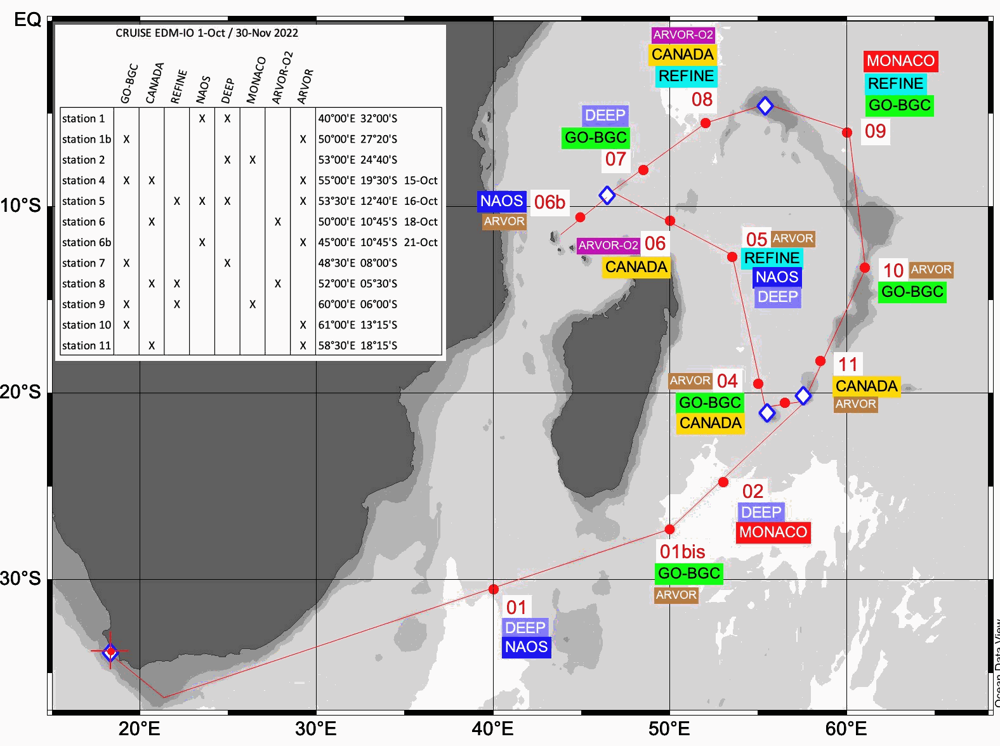

# Oceanographic data collection of the Monaco Exploration Indian Ocean cruise

## People in charge and affiliation

Taillandier Vincent (Laboratoire d'Océanographie de Villefranche, CNRS, Sorbonne Université, Villefranche sur Mer, France)  
Dimier Céline (Insitut de la Mer de Villefranche, CNRS, Sorbonne Université, Villefranche sur Mer, France)
Claustre Hervé (Laboratoire d'Océanographie de Villefranche, CNRS, Sorbonne Université, Villefranche sur Mer, France)
D'Ortenzio Fabrizio (Laboratoire d'Océanographie de Villefranche, CNRS, Sorbonne Université, Villefranche sur Mer, France)
Ternon Jean-Francois (IRD, UMR MARBEC, Sète, France) 

## Scientific context and background

***ADAPTED FROM RIOM ET AL., 2025***

Two quality controlled datasets here archived were collected during the oceanographic cruise MEIO that held in October-November 2022 over the South Western Indian Ocean, onboard S.A. Agulhas II. The first dataset is composed of continuous vertical profiles of the 12 oceanographic stations. The profiles have a resolution of 1dbar. The parameters reported in this data set are: pressure (in dbar), in-situ temperature (in °C), practical salinity, dissolved oxygen concentration (in µmol/kg), fluorescence of calibrated chlorophyll-a fluorescence (in µg/L), nitrate concentration (in µmol/kg) and particle attenuation @660nm (in 1/m). The second dataset is composed of discrete samples collected during the 12 stations. The parameters are the sensors measurements of every samples, dissolved oxygen concentration measured by the Winkler method (in µmol/kg), practical salinity measured by Autosal, concentration of silicate (in µmol/kg), concentration of phosphate (in µmol/kg) , concentration of nitrite (in µmol/kg), concentration of nitrate (in µmol/kg), concentration of pigments (processed by HPLC).

These datasets aim to contribute to the extension of the One-Argo programme in the southwestern area of the Indian Ocean through the deployment of a significant number of floats; and to collect reference measurements through a multi-instrumented CTD rosette, allowing in particular to calibrate the robots’ sensors, just before their deployment.
The two datasets were collected in concomitancy with the deployment of 29 One-Argo floats (WMO numbers : 5906536, 6903149, 4902620, 6903088, 6903148, 6990505, 5906970, 7901013, 4902626, 6903150, 5906972, 6903031, 5906540, 5906969, 4902623, 6990503, 3902471, 5906539, 6990504, 1902572, 5906537, 4902628, 7901003, 3902472, 6903033, 5906538, 1902573, 6903084, 5906971).

## Related publications

+ Wilhem Riom, Vincent Taillandier, Céline Dimier, Fabrizio D'Ortenzio, Hervé Claustre, *Biogeochemical float deployment strategy in the Southwestern Indian ocean* (2025). Deep Sea Research Part II: Topical Studies in Oceanography, Volume 222, 2025, 105504, ISSN 0967-0645, [https://doi.org/10.1016/j.dsr2.2025.105504](https://doi.org/10.1016/j.dsr2.2025.105504).

## Data production details

+ 12 stations in the Southwest Indian Ocean, during the ME-IO campaign
+ 1dbar-resolution profiles

## Target variables

- Biogeochemical properties of seawater, CTD profiles, BGC-Argo
- Pressure (dbar): SBE9
- Temperature (°C): SBE3
- Practical Salinity: SBE4
- Oxygen concentration (µmol/kg); SBE43
- Calibrated Chla fluorescence (µg/L); WetLabs ECO
- Nitrate concentration (µmol/kg); DeepSUNA
- Particle attenuation @660nm (1/m): WetLabs CSTAR

# Data access

+ Data are available on [Seanoe](https://doi.org/10.17882/98833) (directly) and [Sextant](https://sextant.ifremer.fr/Donnees/Catalogue#/metadata/seanoe:98833) (indirectly) for downloading.

## Other Useful information

+ Citation proposal :
Taillandier Vincent, Dimier Céline, Claustre Hervé, D'Ortenzio Fabrizio, Ternon Jean-Francois (2024). *Oceanographic data collection of the Monaco Exploration Indian Ocean cruise.* SEANOE. https://doi.org/10.17882/98833 

