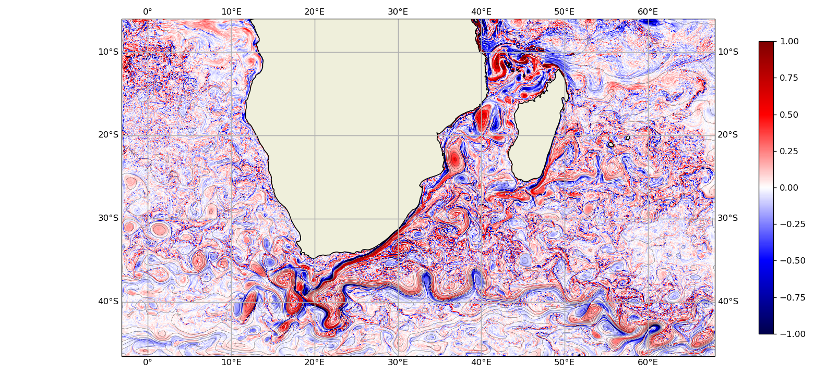
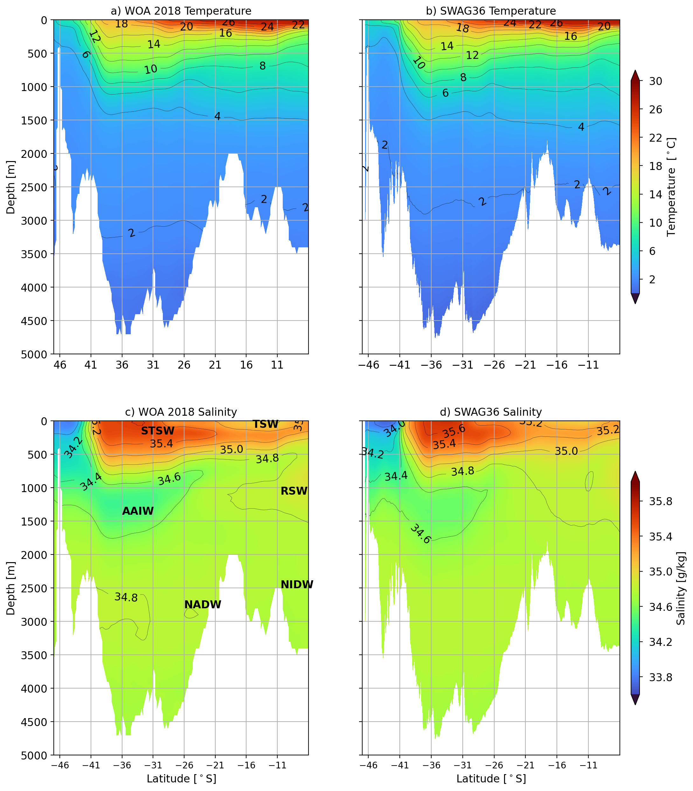

## South West indiAn subtropical Gyre (SWAG) configurations and simulations

### People in charge and affiliation

Pierrick Penven, LOPS, IRD

### Scientific context and background

The SWAG configuration series represents an ocean modeling system for studying regional dynamics in the southwest Indian Ocean. These simulations aim to extend previous work by exploiting the latest advances in data (GEBCO2020, ERA5, GLORYS12) and recent developments in the CROCO model. The objective is to perform high-resolution ocean simulations over a relatively long period (1993-2018), covering the western part of the subtropical gyre of the southwest Indian Ocean and the eastern part of the subtropical gyre of the South Atlantic. These configurations avoid constraints related to sea ice and equatorial dynamics, while including key areas such as Madagascar, the Mozambique Channel, the Agulhas Current, and the Benguela Current. They focus specifically on the interactions between the Mozambique Channel and the Agulhas Current, a region where the mechanisms of energy transfer between eddies and mean currents remain poorly understood.

**Fig. 1 :  Vorticity / f - July 2nd 2000**

SWAG simulations use GLORYS ocean reanalysis at a 1/12° resolution (daily frequency) to constrain the open boundaries of the domain, as well as ERA5 atmospheric reanalysis (hourly frequency) to force a bulk parameterization at the surface. The daily flows of the 56 main rivers in the region, over the period 1993-2020, are taken from the GLOFASv3.1 product. The SWAG4 1/4° and SWAG12 1/12° versions serve as lower-resolution test beds for calibration and sensitivity analyses. The SWAG36 configuration, with a horizontal resolution of 1/36° (2.7 km), includes 2560 x 1680 x 75 grid points. The SWAG36 simulation covered the period 1993-2018 (including 3 years of spin-up) at a total cost of 1,220,000 CPU hours. Each year of SWAG36 simulation, sampled daily, generates 3 TB of data, reaching a total of 100 TB. The SWAG configurations were compared with observations for the representation of the average ocean structure and eddy activity.

**Fig. 2 : comparison between SWAG36 and WOA2018, 42°E**

The SWAG36 outputs are stored on the Jean-Zay cluster with a volume of 100 TB. They can be used as boundary conditions for coastal configurations to study the Benguela Current, the Agulhas Current, or the Mozambique Channel.

### Related publications
+ Le Hir, T., P. Penven, T. Huck, R. Pellen, M. Moulin, M. Rabineau, D. Aslanian, *Impacts of the closure of the Mozambique Channel on the southwest Indian Ocean circulation: A regional numerical simulation*, 2025, J. Mar. Sys., 247, 104024.

+ Penven, P., B. Backeberg, L. Braby, I. Halo, J. Hermes, M. Krug, *Revisiting Mesoscale Variability in the Agulhas System: A Decade Later*, 2025, Proceedings of the Nansen Tutu Center symposium in memory of the late Prof. Mathieu Rouault. Three oceans symposium: Marine science and services in the greater Agulhas region, 6-7 March 2023, Cape Town, Afrique du Sud, 5-8.

### Number of simulations (+ number of members if ensemble)

3 reference runs: SWAG4, SWAG12 et SWAG36

### Configurations, parameters, resolution, timestep, domain, span

+ Existing configurations: SWAG4, SWAG12 et SWAG36
+ SWAG36 : 1/36°  (2.7 km en moyenne sur la zone), dt=100s, longitude -3.16° / 68°, latitude -46.53° / -6°, time span: 1993-2018, 75 sigma-levels
+ Smagorinsky-type parametrization for the Agulhas Current (particular attention to the dynamics of the Agulhas system).

### Target variables

+ zeta, ubar, vbar, u, v, temp, salt, omega, w, bostr, wstr, sustr, svstr, AKt, hbl, hbbl, shflux, swflux, radsw, shflx_rlw, shflx_lat, shflx_sen
+ Barotropic vorticity balance term
+ 2000-2005 trend term of momentum equations

### Related processing tools

### Calculation cost, volume, access

+ Regular CROCO netCDF files (1 file/month), saved as daily mean output
+ Stored on: Jean Zay (IDRIS cluster), former public access with the Thredds server. [A partial extraction for La Reunion Island is available on SEANOE](https://doi.org/10.17882/111850). For more informtion or other locations, please reach to Pierrick Penven if needed.
+ 1 220 000 CPU hours (Jean Zay cluster)
+ 100Tb

### Other Useful information

+ SWAG12: an **Eocene run** has been made
+ SWAG12: a **coupled CROCO-PISCES run** are available (new CROCO-PISCES runs in prep. for SWAG12)
