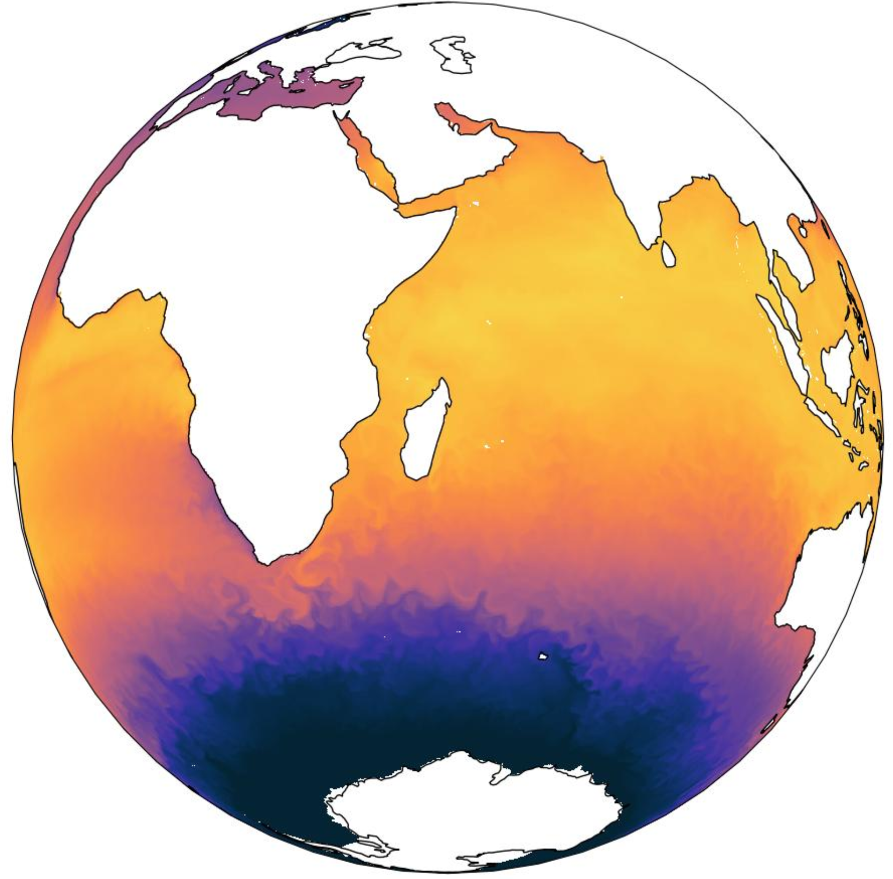

## Global ocean coupled with biogeochemistry simulation from Seamless project - ocean dynamics

### People in charge and affiliation

Jean-Michel Brankart (IGE, CNRS), Mikhaïl Popov (Formerly IGE), Pierre Brasseur (IGE, CNRS)

### Scientific context and background

This dataset contains the dynamical outputs of a global ocean simulation coupling dynamics and biogeochemistry at ¼° over the year 2019. Ocean model NEMO is coupled to ecosystem model PISCES. This simulation is one of the 40 ensemble runs that constitutes a stochastic simulator used in conjonction with ocean colour observations to analyse and predict ecosystem indicators in the Horizon Europe project [SEAMLESS](https://seamlessproject.org/Home.html)

**Fig. 1:  Example of sea-surface temperature in the Indian, South Atlantic and Southern oceans**

See [Popov et al.](https://os.copernicus.org/articles/20/155/2024/) for more details on the study.

### Related publications

+ Popov Mikhail, Brankart Jean-Michel, Capet Arthur, Cosme Emmanuel, Brasseur Pierre (2024). *Ensemble analysis and forecast of ecosystem indicators in the North Atlantic using ocean colour observations and prior statistics from a stochastic NEMO–PISCES simulator*. Ocean Science, 20 (1), 155-180. https://doi.org/10.5194/os-20-155-2024

### Number of simulations (+ number of members if ensemble)

+ 1 ensemble of 40 members

### Configurations, parameters, resolution, timestep, domain, span

+ Domain: 90N,-90S; 180E,-180W (Global)
+ Resolution: 1/4°, 75 z levels
+ Timespan: year 2019

### Target variables
+ Ocean dynamics : u, v, w, temperature and salinity
+ Biology : chl, phy, zoo, o2
+ Nutrients : nitrate, phosphate, silicate, iron
+ Other biological fields : pp, pH, PAR

### Available data for download

**Member 001 outputs only for now**
+ [Ocean dynamics](https://www.seanoe.org/data/00985/109696/)
+ [Biology](https://www.seanoe.org/data/00990/110173/)
+ [Nutrients](https://www.seanoe.org/data/00990/110174/)
+ [Other biological fields]()

### Related processing tools

+ [STOGEN module (Brankart)](https://github.com/brankart/stogen/tree/main) : production of stochastic ensembles
